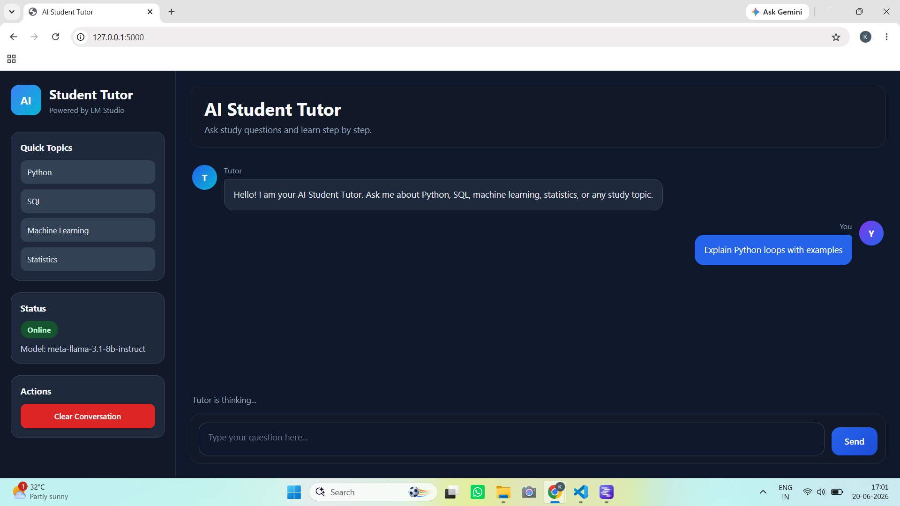
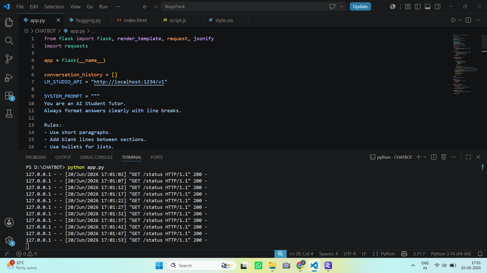

# 🎓 AI Student Tutor

## 📌 Project Overview

AI Student Tutor is an intelligent web-based learning assistant designed to help students understand concepts, answer academic questions, and support self-paced learning. The application integrates with LM Studio to provide AI-powered responses through a user-friendly chat interface.

Built using Flask and modern web technologies, the system offers an interactive learning environment where students can engage in real-time conversations with an AI tutor.

---

## 🎯 Objective

To create an AI-powered educational assistant that helps students:

- Understand academic concepts
- Ask subject-related questions
- Receive instant explanations and guidance
- Enhance self-learning through interactive conversations

---

## ✨ Key Features

### 🤖 AI-Powered Tutoring
- Real-time question answering
- Context-aware responses
- Interactive learning experience

### 💬 Chat Interface
- Clean and intuitive chat layout
- Smooth user interaction
- Conversation-based learning

### 🔗 LM Studio Integration
- Connects to locally hosted AI models
- Supports offline AI interactions
- Fast response generation

### 📡 Model Status Monitoring
- Check LM Studio server availability
- Verify model connectivity
- Display connection status

### 🧹 Conversation Management
- Clear chat history instantly
- Start new learning sessions
- Improved user experience

### 🌙 Modern User Interface
- Dark mode support
- Responsive design
- Student-friendly interface

---

## 🛠️ Technology Stack

| Category | Technologies |
|-----------|-------------|
| Backend | Flask |
| Programming Language | Python |
| AI Integration | LM Studio |
| Frontend | HTML, CSS, JavaScript |
| API Communication | REST API |

---

## 🏗️ System Workflow

```text
Student Question
        │
        ▼
Flask Web Application
        │
        ▼
LM Studio API
        │
        ▼
AI Model Processing
        │
        ▼
Generated Response
        │
        ▼
Chat Interface Display
```

---

## 📂 Project Structure

```text
AI-Student-Tutor/
│
├── app.py
├── requirements.txt
├── README.md
│
├── static/
│   ├── css/
│   ├── js/
│   └── images/
│
└── templates/
    └── index.html
```

---

## ⚡ Installation & Setup

### 1️⃣ Clone the Repository

```bash
git clone https://github.com/yourusername/AI-Student-Tutor.git
cd AI-Student-Tutor
```

### 2️⃣ Install Dependencies

```bash
pip install -r requirements.txt
```

### 3️⃣ Start LM Studio

- Open LM Studio
- Load your preferred language model
- Start the Local Server

### 4️⃣ Run the Application

```bash
python app.py
```

### 5️⃣ Open in Browser

```text
http://127.0.0.1:5000
```

---

## 📸 Project Screenshots

### Chatbot



### Program



---

## 🎓 Learning Outcomes

Through this project, I gained practical experience in:

- Flask Web Development
- AI Application Development
- API Integration
- Frontend-Backend Communication
- User Interface Design
- Local LLM Deployment
- Prompt-Based AI Systems

---

## 🚀 Future Enhancements

- Multi-Subject Support
- Voice-Based Interaction
- Student Progress Tracking
- Conversation Export
- Quiz Generation
- Personalized Learning Recommendations
- Multi-Language Support

---

## 🌟 Applications

- Educational Assistance
- Self-Paced Learning
- Academic Question Answering
- AI-Powered Tutoring
- Concept Revision and Practice

---

## 👩‍💻 Author

**Kavya Raghuvanshi**  
BCA (Artificial Intelligence & Machine Learning)  
Aspiring AI Engineer | Data Analyst | Python Developer

---

⭐ If you found this project useful, consider giving it a Star on GitHub.

> *"Empowering students with AI-driven learning and personalized academic support."* 🎓🤖
